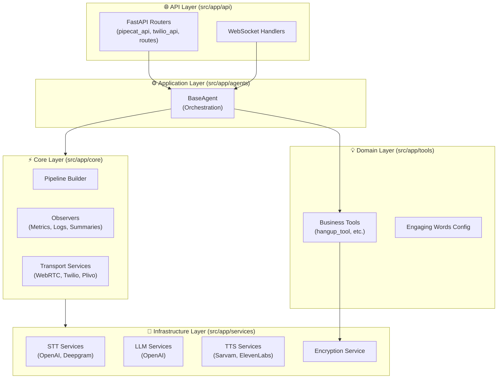
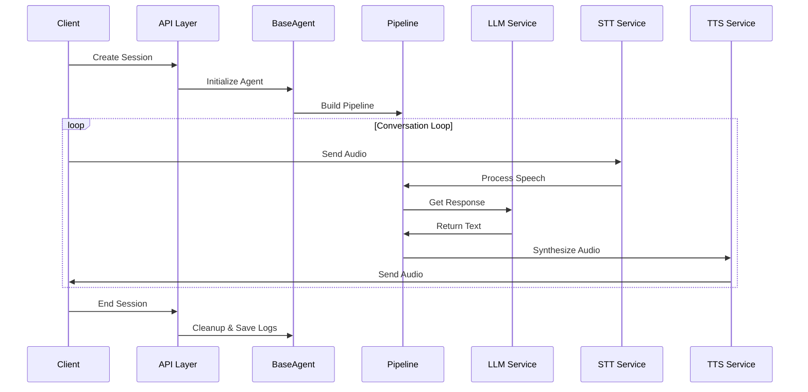
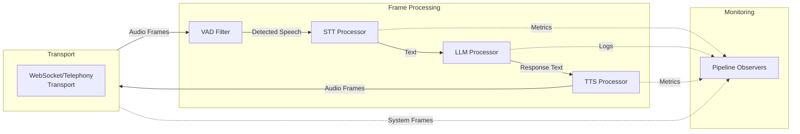
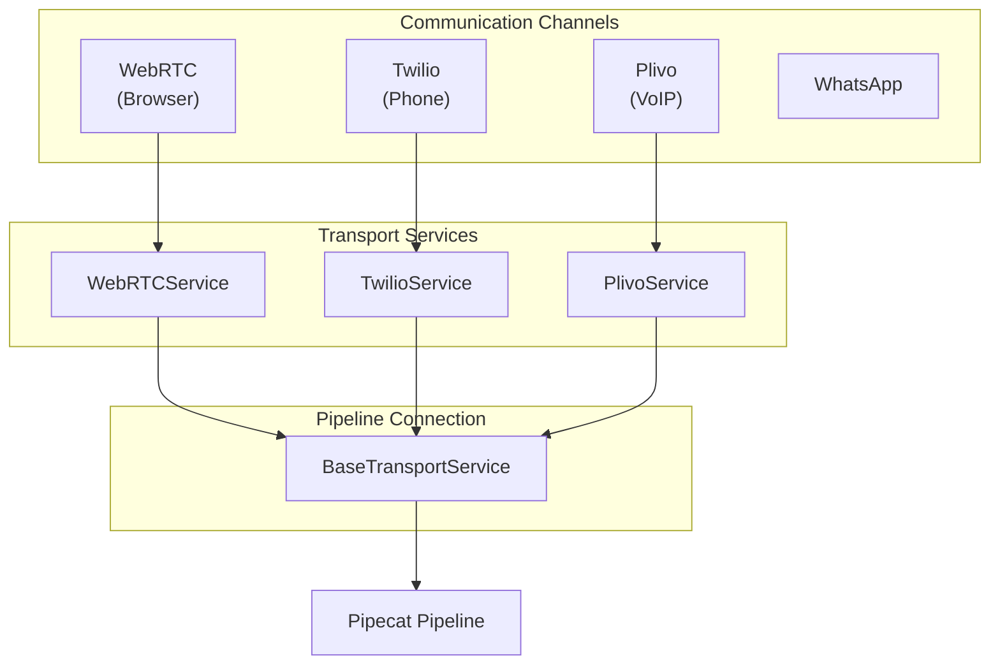
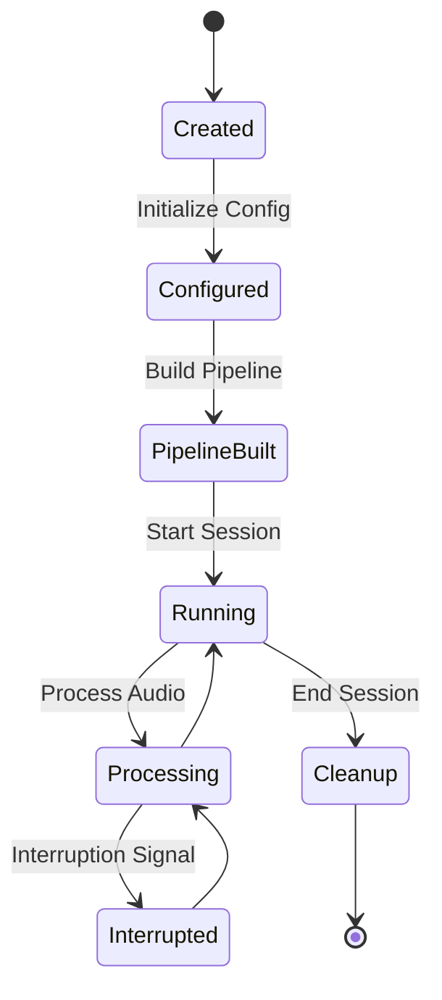
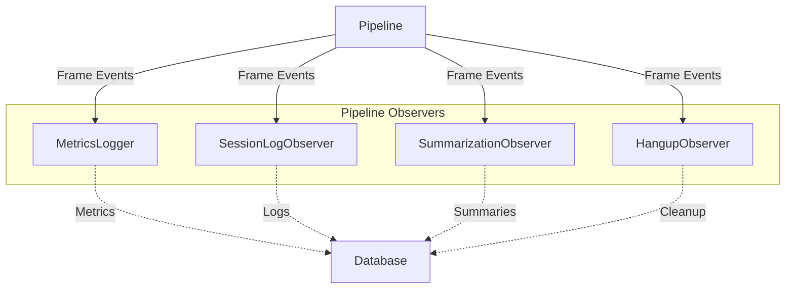
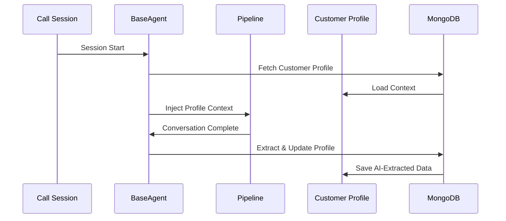

# Architecture Overview

> 📘 **High-level system design** • Read first to understand the big picture

## Introduction

The Pipecat-Service is a voice AI platform built on **Domain-Driven Design (DDD)** principles, providing a scalable and maintainable foundation for building sophisticated conversational AI agents. This document provides a visual overview of system architecture and how components interact.

> 💡 **Tip**: Refer back to this document when you need to understand how different components fit together.

See [ARCHITECTURE_DETAILED.md](ARCHITECTURE_DETAILED.md) for comprehensive architectural decisions and design principles.

---

## System Layers

The application is organized into **4 distinct layers**, each with clear separation of concerns:



### 1. API Layer (`src/app/api`)

**Responsibility**: Entry point for all external interactions (HTTP, WebSocket)

| Aspect | Details |
|--------|---------|
| **Core Function** | Validate requests, route to handlers, format responses |
| **Business Logic** | ❌ None - purely structural |
| **Key Files** | `pipecat_api.py`, `twilio_api.py`, `customer_profile_api.py`, `routes.py` |
| **Technologies** | FastAPI, Pydantic schemas |

### 2. Application Layer (`src/app/agents`)

**Responsibility**: Orchestrates business logic and coordinates services

| Aspect | Details |
|--------|---------|
| **Core Component** | `BaseAgent` - manages voice agent lifecycle |
| **Responsibilities** | Coordinate services, initialize pipelines, manage sessions |
| **Key Files** | `base_agent.py` |
| **Pattern** | Service/Orchestrator pattern |

**Key Interactions**:
- Receives requests from API layer
- Creates domain objects and tools
- Invokes infrastructure services
- Manages pipeline lifecycle

### 3. Domain Layer (`src/app/tools`)

**Responsibility**: Contains core business logic and domain-specific actions

| Aspect | Details |
|--------|---------|
| **Independence** | Completely independent of other layers |
| **Knowledge** | ❌ No databases, APIs, or external services |
| **Key Modules** | `hangup_tool.py`, `session_context_tool.py`, `warm_transfer_tool.py`, `engaging_words_config.py` |
| **Principle** | Pure business logic |

### 4. Infrastructure Layer (`src/app/services`)

**Responsibility**: Implements interactions with external systems

| Aspect | Details |
|--------|---------|
| **Key Integrations** | STT, LLM, TTS, encryption, databases |
| **Providers Supported** | OpenAI, Gemini, Sarvam, ElevenLabs, etc. |
| **Pattern** | Adapter/Bridge pattern |
| **Key Files** | `stt/`, `llm/`, `tts/` service implementations |

---

## Request Flow

Here's how a typical request flows through the system:



**Key Steps**:
1. API validates request and creates session
2. BaseAgent initializes with configuration
3. Pipeline built from config (STT → LLM → TTS)
4. Real-time audio flows through pipeline
5. Session cleanup and artifact logging

---

## Pipeline Architecture

The **pipeline** is the core of the voice interaction system, built on Pipecat's frame-based architecture:



### Frame Types

| Type | Purpose | Examples |
|------|---------|----------|
| **Data Frames** | Payload (audio, text, data) | AudioFrame, TextFrame |
| **System Frames** | Lifecycle events | StartFrame, EndFrame, InterruptionFrame |
| **Control Frames** | Runtime commands | PauseFrame, ResumeFrame, MuteFrame |

---

## Transport Layer Abstraction

The transport layer bridges external communication channels with the pipeline:



**Transport Responsibilities**:
- Receive incoming connections
- Authenticate and route requests
- Convert channel-specific formats to/from pipeline frames
- Manage connection lifecycle (open, close, reconnect)

---

## Agent Lifecycle

Agents go through distinct lifecycle phases:



**Phase Descriptions**:

| Phase | What Happens | Resources |
|-------|-------------|-----------|
| **Created** | Agent instance initialized | Config loaded |
| **Configured** | Services configured (STT, LLM, TTS) | API keys, models prepared |
| **PipelineBuilt** | Frame processors linked together | Memory, queues allocated |
| **Running** | Session active and listening | Real-time connection open |
| **Processing** | Active conversation handling | CPU/memory for inference |
| **Cleanup** | Resources released, logs persisted | Database writes |

---

## Observer Pattern for Monitoring

The system uses **observers** to hook into pipeline lifecycle events without coupling to business logic:



**Observer Types**:

| Observer | Purpose | Data Captured |
|----------|---------|---------------|
| **MetricsLogger** | Performance tracking | Latency, throughput, queue depth |
| **SessionLogObserver** | Interaction history | Transcript, timestamps, events |
| **SummarizationObserver** | Call analysis | Transcript for summarization |
| **HangupObserver** | Call cleanup | Hangup reason, cleanup tasks |
| **ReasonObserver** | Decision tracking | LLM reasoning and decisions |

**Benefits**:
- ✅ Non-intrusive monitoring
- ✅ Easy to add/remove observers
- ✅ Decoupled from core logic
- ✅ Real-time event streaming

---

## Core Layer (Cross-Cutting Concerns)

Located in `src/app/core`, this layer handles system-wide concerns:

| Concern | Location | Purpose |
|---------|----------|---------|
| **Configuration** | `config.py` | Application settings and defaults |
| **Constants** | `constants.py` | Centralized constants and enums |
| **Pipeline Builder** | `pipeline_builder/` | Constructs pipelines from config |
| **Transports** | `transports/` | Communication channel management |
| **Observers** | `observers/` | Monitoring and logging hooks |
| **Utilities** | `utils/` | Shared helper functions |

---

## Data Flow Example: Customer Profile Integration

Here's a concrete example of how customer profiles integrate:



**Process**:
1. Session begins with customer identifier
2. Profile loaded from database (email, phone, history)
3. Profile injected into system prompt
4. Conversation proceeds naturally
5. Post-call, AI extracts insights
6. Profile updated with new data

---

## Configuration-Driven Architecture

The system is **heavily configuration-driven** through `AgentConfig`. This enables different assistants without code changes:

```
AgentConfig
├── Pipeline Mode (traditional, multimodal)
├── STT Config
│   ├── Provider (openai, sarvam, etc.)
│   └── Model & language settings
├── TTS Config
│   ├── Provider & voice selection
│   └── Speed & tone settings
├── LLM Config
│   ├── Provider & model
│   └── Temperature, context window
├── Tools Config
│   └── Available business tools
├── Context Config
│   └── What context to include
├── Customer Profile Config
│   ├── Use in prompt (yes/no)
│   ├── Update after call (yes/no)
│   └── Extraction fields
├── Summarization Config
│   ├── Provider & model
│   └── Prompt template
└── Transport-Specific Settings
```

**Benefits**:
- 🎛️ No code changes to switch models
- 📊 Per-assistant configuration
- ✨ Feature toggles via config
- 🔄 Dynamic reconfiguration

---

## Error Handling & Resilience

The system implements **multiple layers of resilience**:

```
┌─────────────────────────────────────────┐
│ Request Level                           │
│ Schema validation catches malformed     │
│ inputs early                            │
└─────────────────────────────────────────┘
            ↓
┌─────────────────────────────────────────┐
│ Service Level                           │
│ Individual services have timeout        │
│ and retry logic                         │
└─────────────────────────────────────────┘
            ↓
┌─────────────────────────────────────────┐
│ Pipeline Level                          │
│ Frame processors handle errors          │
│ gracefully                              │
└─────────────────────────────────────────┘
            ↓
┌─────────────────────────────────────────┐
│ Session Level                           │
│ Failed operations log and notify        │
│ without crashing                        │
└─────────────────────────────────────────┘
            ↓
┌─────────────────────────────────────────┐
│ Application Level                       │
│ Observers capture and report            │
│ all events                              │
└─────────────────────────────────────────┘
```

---

## Security Architecture

| Aspect | Implementation |
|--------|----------------|
| **Tenant Isolation** | Every operation scoped to `tenant_id` |
| **Authentication** | Bearer tokens with JWT validation |
| **Encryption** | Sensitive data (API keys) encrypted at rest with Fernet |
| **Audit Trail** | All changes logged with user information |
| **Rate Limiting** | 1000 req/hour per token |
| **RBAC** | Role-based access control (admin, user, viewer) |

---

## Component Dependencies

```
Domain Layer (tools)
    ↓ (uses)
Infrastructure Layer (services)
    
Application Layer (agents)
    ↓ (uses)
Domain + Infrastructure
    ↓ (uses)
Core Layer (transports, observers)

API Layer
    ↓ (calls)
Application Layer
```

**Key Principle**: Inner layers never depend on outer layers.

---

## Performance Considerations

| Component | Optimization |
|-----------|--------------|
| **Pipeline** | Frame-based streaming (not batch) |
| **STT/TTS** | Async/concurrent processing |
| **LLM** | Token streaming for lower latency |
| **Database** | Indexed queries, pagination |
| **Caching** | Pre-request result caching |

---

## Extensibility

The architecture is designed for extension:

- **Add New Transport**: Implement `BaseTransportService`
- **Add New Service**: Implement appropriate factory
- **Add New Tool**: Create `Tool` class in domain layer
- **Add New Observer**: Extend `BaseObserver`
- **Add New LLM**: Implement LLM service interface

---

## Next Steps

To understand specific components in depth:

- **[BUSINESS_TOOLS_GUIDE.md](BUSINESS_TOOLS_GUIDE.md)** - Building and integrating tools
- **[CONFIGURABLE_SUMMARIES.md](CONFIGURABLE_SUMMARIES.md)** - Call summaries and AI extraction
- **[DATABASE_COLLECTIONS_STRUCTURE.md](DATABASE_COLLECTIONS_STRUCTURE.md)** - Data models
- **[API_GUIDE.md](API_GUIDE.md)** - API endpoint reference
- **[DEPLOYMENT_CONFIGURATION.md](DEPLOYMENT_CONFIGURATION.md)** - Environment variables & Docker

Or return to [README.md](README.md) for full navigation.

