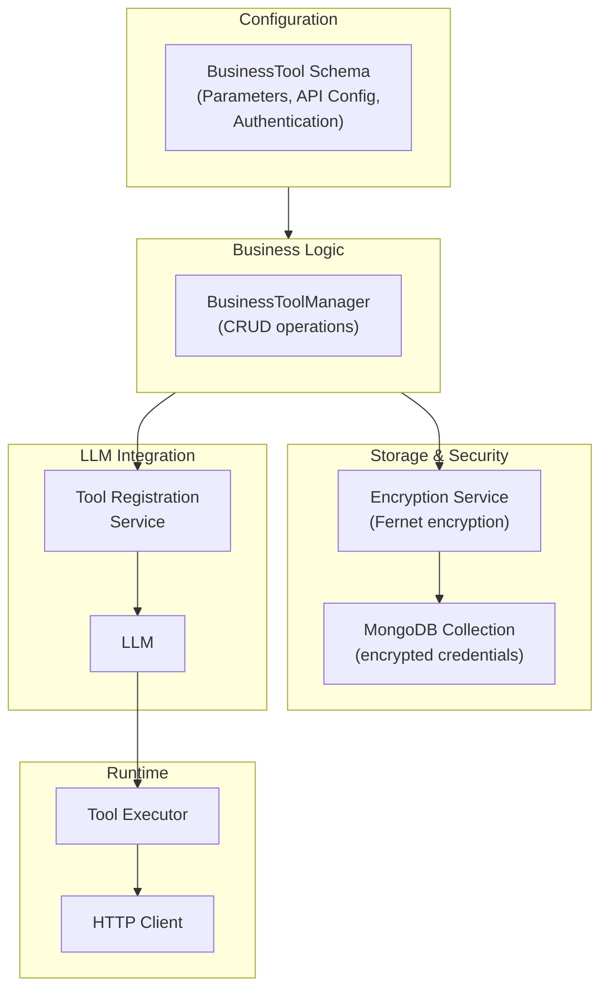

# Business Tools Guide

> 🛠️ **Tool configuration & integration** • Complete guide to business tools system

## Overview

Business Tools is a simplified system for integrating external APIs into voice agents without complex custom code. It replaces the legacy custom API tools system with a more maintainable, configuration-driven approach.

**Key Benefits**:
- Simple configuration without code changes
- Multi-step API workflows (pre-requests)
- Automatic credential encryption
- LLM-friendly parameter collection
- Built-in caching for efficiency
- Dynamic registration with the LLM

## Architecture



## Core Concepts

### Business Tool Schema

A business tool defines:

1. **Metadata**: Name, description, tenant scope
2. **Parameters**: What the AI needs to collect from the user
3. **API Configuration**: How to call the external API
4. **Pre-Requests**: Optional preliminary API calls (e.g., get session ID first)
5. **Authentication**: Credentials for the external API
6. **Engaging Words**: User-friendly feedback while the tool runs

### Parameter Types

```
FieldType Enum:
├── STRING              # Text values
├── INTEGER             # Whole numbers
├── BOOLEAN             # True/false
├── ARRAY               # List of values
├── EMAIL               # Email addresses (with validation)
├── PHONE_NUMBER        # Phone numbers (with validation)
├── URL                 # Web URLs (with validation)
├── DATE                # Date values (YYYY-MM-DD)
└── DATETIME            # Date-time values (ISO 8601)
```

**Example Parameter Definition**:

```python
BusinessParameter(
    name="customer_email",
    type=FieldType.EMAIL,
    description="The customer's email address",
    required=True,
    examples=["john@example.com", "jane@company.org"]
)
```

## Authentication Methods

The system supports multiple authentication approaches:

### 1. Bearer Token

```python
BearerAuthConfig(
    type="bearer",
    token="sk-1234567890..."  # Can use {{ENV_VAR}} syntax
)
```

**Use Case**: API keys, OpenAI tokens, etc.

### 2. API Key

```python
ApiKeyAuthConfig(
    type="api_key",
    api_key="your-api-key-here",
    header_name="X-API-Key"  # Custom header name
)
```

**Use Case**: Custom API services with API key headers

### 3. Basic Authentication

```python
BasicAuthConfig(
    type="basic",
    username="user",
    password="pass"
)
```

**Use Case**: Simple HTTP basic auth

### 4. OAuth 2.0

```python
OAuth2AuthConfig(
    type="oauth2",
    client_id="your-client-id",
    client_secret="your-client-secret",
    token_url="https://api.example.com/oauth/token",
    scope="read write",
    grant_type="client_credentials"
)
```

**Use Case**: Modern OAuth-protected services

### 5. Custom Headers

```python
CustomAuthConfig(
    type="custom",
    headers={
        "Authorization": "Bearer token123",
        "X-Custom-Auth": "value"
    }
)
```

**Use Case**: Multiple custom auth headers

### 6. Custom Token Database

```python
CustomTokenDBAuthConfig(
    type="custom_token_db",
    credential_id="cred-12345"  # Reference to stored credential
)
```

**Use Case**: Dynamic tokens that rotate or require multiple tokens
- Supports multi-token authentication (access_token + id_token)
- Automatic token rotation from API responses
- Secure storage in database

## API Configuration

```python
APIConfig(
    base_url="https://api.example.com",
    endpoint="/api/v1/process",
    method="POST",
    timeout_seconds=30.0,
    authentication=BearerAuthConfig(...),
    query_params={
        "version": "2024-01",
        "user_id": "{{user_id}}"  # Template variable
    },
    body_template={
        "action": "submit",
        "data": "{{customer_email}}",
        "metadata": "{{pre_request.session_id}}"  # From pre-request
    },
    success_message="Your request has been submitted successfully",
    error_message="I encountered an error processing your request"
)
```

**Template Variables**:
- `{{param_name}}`: AI-collected parameter
- `{{pre_request.field_name}}`: Field extracted from pre-request response

## Multi-Step Workflows: Pre-Requests

Pre-requests enable chaining API calls where data from one response feeds into the next:

```python
PreRequestConfig(
    name="get_session",
    description="Initialize a session and get session ID",
    endpoint="/api/v1/sessions/init",
    method="POST",
    body_template={
        "user": "{{user_id}}"
    },
    extract_fields={
        "session_id": "$.sessionId",  # JSONPath
        "session_token": "$.token"
    },
    timeout_seconds=10.0,
    cache_config=PreRequestCacheConfig(
        enabled=True,
        cache_key="session_cache"
    )
)
```

**Usage in Main API Call**:

```python
APIConfig(
    base_url="https://api.example.com",
    endpoint="/api/v1/process",
    body_template={
        "session_id": "{{pre_request.session_id}}",  # From pre-request
        "data": "{{customer_input}}"
    }
)
```

**Execution Flow**:

```
1. Pre-request /sessions/init → Get session_id
2. Cache session_id for duration of call
3. Main API call /process → Use cached session_id
4. Return result to AI
```

## Caching Configuration

Pre-request results can be cached for the session duration:

```python
PreRequestCacheConfig(
    enabled=True,
    cache_key="session_cache"  # Optional custom key
)
```

**Benefits**:
- Reduces redundant API calls
- Improves response time
- Lowers costs
- Cache persists for entire session (automatically cleared at end)

**Example**: Initialize session once, use in multiple tool calls

## Security: Credential Encryption

All sensitive credentials are encrypted at rest using Fernet encryption:

```
Credential Storage Flow:
┌─────────────────────────────────────────┐
│ Tool Configuration                      │
│ ├─ Plain credentials (in memory)        │
│ └─ Encrypted credentials (in database)  │
└─────────────────────────────────────────┘
      ↓
┌─────────────────────────────────────────┐
│ On Save:                                │
│ 1. Serialize credentials                │
│ 2. Encrypt with Fernet key              │
│ 3. Prefix with "encrypted:"             │
│ 4. Store in MongoDB                     │
└─────────────────────────────────────────┘
      ↓
┌─────────────────────────────────────────┐
│ On Retrieval:                           │
│ 1. Read from MongoDB                    │
│ 2. Check for "encrypted:" prefix        │
│ 3. Decrypt with Fernet key              │
│ 4. Return plain credentials in memory   │
└─────────────────────────────────────────┘
```

**Encrypted Fields by Auth Type**:
- **Bearer**: `token`
- **API Key**: `api_key`
- **Basic**: `username`, `password`
- **OAuth2**: `client_secret`
- **Custom**: All header values
- **CustomTokenDB**: Skipped (uses separate encrypted storage)

## Tool Manager API

The `BusinessToolManager` handles all CRUD operations:

### Create Tool

```python
from app.managers.business_tool_manager import BusinessToolManager

tool_id = await manager.create_tool(
    BusinessToolCreateRequest(
        name="send_email",
        description="Send an email to a customer",
        parameters=[
            BusinessParameter(
                name="recipient_email",
                type=FieldType.EMAIL,
                description="Email recipient",
                required=True
            ),
            BusinessParameter(
                name="subject",
                type=FieldType.STRING,
                description="Email subject",
                required=True
            ),
            BusinessParameter(
                name="body",
                type=FieldType.STRING,
                description="Email body",
                required=True
            )
        ],
        api_config=APIConfig(
            base_url="https://api.example.com",
            endpoint="/mail/send",
            method="POST",
            authentication=BearerAuthConfig(token="{{API_KEY}}"),
            body_template={
                "to": "{{recipient_email}}",
                "subject": "{{subject}}",
                "body": "{{body}}"
            }
        )
    ),
    user_info=UserInfo(...)
)
```

### Retrieve Tool

```python
tool = await manager.get_tool("tool-id")
# Returns BusinessTool with decrypted credentials
```

### List Tools

```python
tools, total = await manager.list_tools(skip=0, limit=20)
```

### Update Tool

```python
updated = await manager.update_tool(
    "tool-id",
    BusinessToolUpdateRequest(
        description="Updated description"
    ),
    user_info=UserInfo(...)
)
```

### Delete Tool

```python
deleted = await manager.delete_tool("tool-id", user_info=UserInfo(...))
```

### Validate Tool IDs

```python
existing_ids, missing_ids = await manager.validate_tool_ids([
    "tool-1", "tool-2", "tool-3"
])
```

## API Endpoints

### Create Tool

```http
POST /api/v1/business-tools
Content-Type: application/json

{
    "name": "send_email",
    "description": "Send email to customer",
    "parameters": [...],
    "api_config": {...}
}

Response: 201 Created
{
    "tool_id": "tool-1234567890",
    "name": "send_email",
    ...
}
```

### Get Tool

```http
GET /api/v1/business-tools/{tool_id}

Response: 200 OK
{
    "tool_id": "tool-1234567890",
    "name": "send_email",
    "description": "Send email to customer",
    ...
}
```

### List Tools

```http
GET /api/v1/business-tools?skip=0&limit=20

Response: 200 OK
{
    "tools": [
        {
            "tool_id": "...",
            "name": "...",
            "description": "...",
            "parameter_count": 3,
            "created_at": "...",
            "updated_at": "..."
        }
    ],
    "total": 42
}
```

### Update Tool

```http
PUT /api/v1/business-tools/{tool_id}
Content-Type: application/json

{
    "description": "Updated description",
    "engaging_words": "Processing your email..."
}

Response: 200 OK
{
    "success": true
}
```

### Delete Tool

```http
DELETE /api/v1/business-tools/{tool_id}

Response: 204 No Content
```

### Test Tool

```http
POST /api/v1/business-tools/{tool_id}/test
Content-Type: application/json

{
    "parameters": {
        "recipient_email": "user@example.com",
        "subject": "Test Subject",
        "body": "Test body"
    }
}

Response: 200 OK
{
    "success": true,
    "status_code": 200,
    "response_data": {...},
    "processed_response": {...},
    "execution_time_ms": 145.3,
    "transformation_log": [...]
}
```

## Tool Registration with LLM

Tools are automatically registered with the LLM when an agent is configured:

```python
from app.services.tool_registration_service import ToolRegistrationService

# Service automatically:
# 1. Fetches enabled tools from config
# 2. Converts parameters to LLM function schema
# 3. Registers with LLM (OpenAI, Gemini, etc.)
# 4. Handles tool calls during conversation
```

**LLM Function Schema Generated**:

```json
{
    "type": "function",
    "function": {
        "name": "send_email",
        "description": "Send an email to a customer",
        "parameters": {
            "type": "object",
            "properties": {
                "recipient_email": {
                    "type": "string",
                    "description": "Email recipient"
                },
                "subject": {
                    "type": "string",
                    "description": "Email subject"
                },
                "body": {
                    "type": "string",
                    "description": "Email body"
                }
            },
            "required": ["recipient_email", "subject", "body"]
        }
    }
}
```

## Complete Example: Payment Tool

```python
# Create a tool to process payments
tool_config = BusinessToolCreateRequest(
    name="process_payment",
    description="Process a payment transaction for the customer",
    parameters=[
        BusinessParameter(
            name="amount",
            type=FieldType.INTEGER,
            description="Payment amount in cents",
            required=True,
            examples=["1000", "5000"]
        ),
        BusinessParameter(
            name="customer_id",
            type=FieldType.STRING,
            description="Customer identifier",
            required=True
        ),
        BusinessParameter(
            name="payment_method",
            type=FieldType.STRING,
            description="Payment method: credit_card or bank_transfer",
            required=True,
            examples=["credit_card", "bank_transfer"]
        )
    ],
    pre_requests=[
        PreRequestConfig(
            name="get_customer",
            description="Get customer account details",
            endpoint="/api/customers/{{customer_id}}",
            method="GET",
            extract_fields={
                "account_status": "$.status",
                "credit_limit": "$.creditLimit"
            },
            cache_config=PreRequestCacheConfig(enabled=True, cache_key="customer_cache")
        )
    ],
    api_config=APIConfig(
        base_url="https://payments.example.com",
        endpoint="/api/v2/transactions",
        method="POST",
        authentication=OAuth2AuthConfig(
            client_id="{{PAYMENT_CLIENT_ID}}",
            client_secret="{{PAYMENT_CLIENT_SECRET}}",
            token_url="https://auth.example.com/token"
        ),
        body_template={
            "amount": "{{amount}}",
            "customer_id": "{{customer_id}}",
            "payment_method": "{{payment_method}}",
            "account_status": "{{pre_request.account_status}}",
            "idempotency_key": "{{session_id}}"  # Prevent duplicate charges
        },
        success_message="Payment processed successfully! Transaction ID: {{transaction_id}}",
        error_message="Payment processing failed. Please try again."
    ),
    engaging_words="Processing your payment securely..."
)

# Create the tool
tool_id = await tool_manager.create_tool(tool_config, user_info)

# Now the LLM can call this tool:
# User: "Process a $50 payment for me"
# LLM: Calls process_payment(amount=5000, customer_id="...", payment_method="credit_card")
# Tool: Pre-request gets customer details, Main request processes payment, Returns result
# LLM: "Your payment has been processed successfully!"
```

## Best Practices

### 1. Credential Management
- Use environment variables via `{{ENV_VAR}}` syntax
- Never commit credentials to version control
- Rotate credentials regularly
- Use CustomTokenDB for dynamic tokens

### 2. Error Handling
- Provide meaningful error messages for LLM
- Map HTTP status codes to user-friendly messages
- Log failures for debugging
- Implement retry logic for transient failures

### 3. Performance
- Set appropriate timeouts (balance between user experience and reliability)
- Use caching for frequently-accessed data
- Minimize pre-request depth (avoid long chains)
- Test tools with production-like loads

### 4. Security
- Validate all LLM-provided parameters
- Sanitize user inputs before API calls
- Use HTTPS for all external APIs
- Implement rate limiting
- Audit all tool executions

### 5. User Experience
- Use engaging words that match the assistant's personality
- Provide clear status messages for long-running operations
- Handle unexpected API responses gracefully
- Include examples in parameter definitions

## Troubleshooting

**Issue**: Tool parameters not being collected
- **Solution**: Ensure `required=True` for critical parameters
- **Solution**: Provide clear descriptions and examples

**Issue**: Encrypted credential errors
- **Solution**: Check that encryption key is set correctly
- **Solution**: Verify credentials weren't already encrypted

**Issue**: Pre-request extraction failing
- **Solution**: Verify JSONPath expressions match API response structure
- **Solution**: Add logging to debug extraction

**Issue**: Tool not visible to LLM
- **Solution**: Check tool is enabled in assistant config
- **Solution**: Verify tool_id is correct
- **Solution**: Ensure LLM has been re-initialized after tool changes

## See Also

- [ARCHITECTURE_OVERVIEW.md](ARCHITECTURE_OVERVIEW.md) - System design overview
- [API_GUIDE.md](API_GUIDE.md) - Business tools API endpoints
- [DATABASE_COLLECTIONS_STRUCTURE.md](DATABASE_COLLECTIONS_STRUCTURE.md) - Tools collection schema
- [CONFIGURABLE_SUMMARIES.md](CONFIGURABLE_SUMMARIES.md) - Using tools with profiles
- [README.md](README.md) - Documentation index

---

📖 **Return to**: [README.md](README.md)
