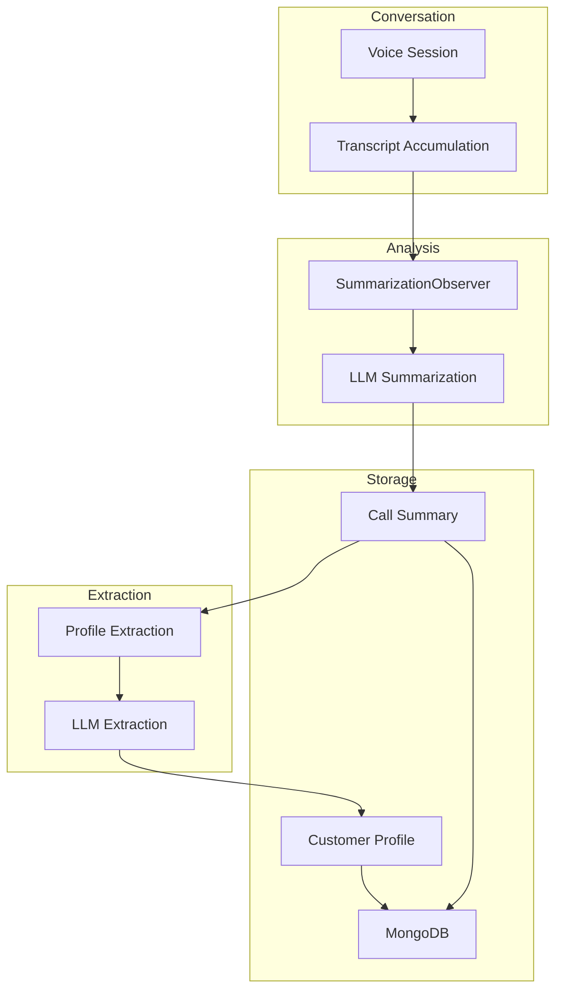
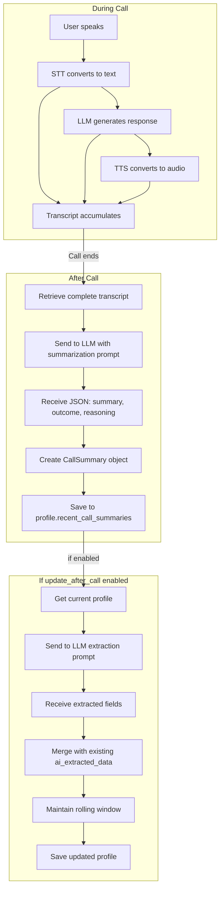

# Configurable Summaries & AI Extraction

> 🧠 **AI-powered insights** • Call summaries and customer profile enrichment

## Overview

Configurable Summaries enable AI-powered analysis of conversations with automatic customer profile enrichment. The system uses LLM-based summarization to generate conversation summaries, classify outcomes, and extract customer insights into profiles.

**Key Features**:
- Automatic call summarization at end of session
- Outcome classification (Interested / Not Interested)
- Configurable LLM providers (OpenAI, Gemini)
- AI extraction of customer data into profiles
- Rolling window of recent summaries (4 recent + 1 aggregated)
- Configurable extraction fields per assistant
- Observer-based non-intrusive integration

## Architecture



## Summarization Process

### 1. Transcript Accumulation

During the conversation, all messages (user and assistant) are accumulated:

```
User: "Hi, I'm interested in your product"
Assistant: "Great! Tell me more about..."
User: "I use it for..."
Assistant: "That's a good fit because..."
```

### 2. Summarization Trigger

At session end, the accumulated transcript is sent to the LLM with a prompt:

```json
{
    "role": "user",
    "content": "You are an intelligent call analysis assistant. Based on the following conversation transcript, please provide a summary and analysis in JSON format.\n\nThe JSON object should have the following structure:\n{\n  \"summary\": \"<A concise summary of the conversation>\",\n  \"outcome\": \"<'Interested' if the user showed clear interest in a product/service or agreed to a follow-up, otherwise 'Not Interested'>\",\n  \"reasoning\": \"<A brief explanation for your outcome classification>\"\n}\n\nHere is the conversation:\n[transcript]"
}
```

### 3. LLM Response

The LLM returns structured JSON:

```json
{
    "summary": "Customer inquired about our enterprise plan. They currently use a competitor's solution but were impressed by our AI features. Expressed interest in a demo and provided contact info.",
    "outcome": "Interested",
    "reasoning": "Customer explicitly asked for a demo and provided follow-up contact information, indicating genuine interest."
}
```

## Summarization Configuration

### OpenAI Configuration

```python
OpenAISummarizationConfig(
    provider="openai",
    model="gpt-4o",
    prompt_template="""You are an intelligent call analysis assistant...
[your custom prompt]"""
)
```

**Supported Models**:
- `gpt-4o` (Recommended)
- `gpt-4-turbo`
- `gpt-4`
- `gpt-3.5-turbo`

### Gemini Configuration

```python
GeminiSummarizationConfig(
    provider="gemini",
    model="gemini-1.5-flash",
    prompt_template="""You are an intelligent call analysis assistant...
[your custom prompt]"""
)
```

**Supported Models**:
- `gemini-1.5-flash` (Recommended - fast, cost-effective)
- `gemini-1.5-pro` (More capable but slower)
- `gemini-1.0-pro`

### Configuration in AgentConfig

```python
AgentConfig(
    summarization_enabled=True,
    summarization=OpenAISummarizationConfig(
        provider="openai",
        model="gpt-4o",
        prompt_template="..."
    ),
    # ... other config
)
```

## Call Summary Storage

Summaries are stored in the customer profile with a rolling window strategy:

```python
class CallSummary(BaseSchema):
    session_id: str                    # Link to session
    summary_text: str                  # Generated summary
    outcome: str | None                # "Interested" or "Not Interested"
    timestamp: datetime                # When call occurred
    transport_type: str                # webrtc, plivo, twilio, etc.
    duration_seconds: int | None       # Call length
```

### Rolling Window Strategy

The system maintains:

1. **Recent Call Summaries** (Last 4):
   - Stored verbatim
   - Used as context for AI interactions
   - Most recent first

2. **Aggregated Older Summary** (Beyond 4):
   - Single LLM-generated summary of calls 5+
   - Regenerated when new summary is added
   - Provides long-term context without overwhelming AI

**Example Profile State**:

```json
{
    "profile_id": "prof-123",
    "total_call_count": 8,
    "recent_call_summaries": [
        {
            "session_id": "sess-8",
            "summary_text": "Customer discussed enterprise plan pricing",
            "outcome": "Interested",
            "timestamp": "2024-12-11T15:30:00Z",
            "transport_type": "webrtc",
            "duration_seconds": 420
        },
        {
            "session_id": "sess-7",
            "summary_text": "Technical questions about integration",
            "outcome": "Interested",
            "timestamp": "2024-12-10T10:15:00Z",
            "transport_type": "twilio",
            "duration_seconds": 620
        },
        // ... 2 more summaries ...
    ],
    "aggregated_older_summary": "Customer has had 4 previous calls exploring our product. Initially interested in SMB plan but upgraded after demo to enterprise plan. Has integrated with 2 systems..."
}
```

## AI Extraction: Customer Profile Updates

After summarization, AI extracts structured data into the customer profile:

### Configuration

```python
CustomerProfileConfig(
    use_in_prompt=True,              # Inject profile into system prompt
    update_after_call=True,          # Update profile after call
    ai_required_fields=[             # What to extract
        "name",
        "interests",
        "communication_preferences",
        "follow_up_date",
        "budget_range"
    ]
)
```

### Default Extraction Fields

From `src/app/core/constants.py`:

```python
CUSTOMER_PROFILE_AI_REQUIRED_FIELDS = [
    "name",
    "phone",
    "email",
    "interests",
    "communication_preferences",
    "follow_up_date",
    "notes",
    "budget_range"
]
```

### Extraction Prompt

```
Extract the following fields from this conversation and customer profile context:

Required Fields:
- name: Customer's name
- interests: What the customer is interested in
- communication_preferences: How they prefer to be contacted
- follow_up_date: When to follow up next
- budget_range: Their budget (if mentioned)

Current Profile:
{
    "name": "John Doe",
    "interests": ["email_marketing", "crm"],
    "follow_up_date": "2024-12-15"
}

Conversation:
[transcript]

Instructions:
1. Extract ONLY fields that were explicitly mentioned or strongly implied
2. Preserve existing data - only update if new information is provided
3. Return JSON object with extracted fields
4. Set field to null if not found or not updated
```

### AI Extraction Process

```
Conversation happens...
         ↓
Summarization generates summary
         ↓
Profile exists? → Fetch current profile
         ↓
LLM extracts fields from:
  - Conversation transcript
  - Previous profile data
  - Summarization output
         ↓
ai_extracted_data field updated:
{
    "name": "Jane Smith",
    "interests": ["payment_processing", "fraud_detection"],
    "communication_preferences": "email_preferred",
    "follow_up_date": "2024-12-18",
    "budget_range": "$50k-$100k"
}
         ↓
Profile saved to database
```

## Usage Examples

### Example 1: Sales Call with Profile Updates

```
Assistant Config:
{
    "summarization_enabled": true,
    "summarization": {
        "provider": "openai",
        "model": "gpt-4o"
    },
    "customer_profile_config": {
        "use_in_prompt": true,
        "update_after_call": true,
        "ai_required_fields": [
            "name", "company", "interests",
            "timeline", "decision_makers", "budget"
        ]
    }
}

Call Flow:
1. Customer profile loaded at session start
2. AI uses profile in system prompt: "This is Jane at Acme Inc..."
3. Conversation proceeds naturally
4. Call ends
5. Transcript summarized: "Jane interested in enterprise plan..."
6. AI extracts new data: "decision_makers": ["Jane", "CFO"], "timeline": "Q1 2025"
7. Profile updated with new insights
```

### Example 2: Support Call

```
Assistant Config:
{
    "summarization_enabled": true,
    "summarization": {
        "provider": "gemini",
        "model": "gemini-1.5-flash"
    },
    "customer_profile_config": {
        "use_in_prompt": false,     # Don't inject profile
        "update_after_call": true,  # Still update it
        "ai_required_fields": [
            "last_issue_resolved",
            "product_version_using",
            "support_tier",
            "satisfaction"
        ]
    }
}

Call Flow:
1. Customer calls support (profile not injected)
2. Support agent helps resolve issue
3. Transcript summarized: "Customer had integration error with v2.5..."
4. AI extracts: "last_issue_resolved": "API timeout", "satisfaction": "high"
5. Profile updated for next support interaction
```

### Example 3: Outbound Campaign

```
Assistant Config:
{
    "summarization_enabled": true,
    "customer_profile_config": {
        "use_in_prompt": true,
        "update_after_call": true,
        "ai_required_fields": [
            "interests",
            "not_interested_reason",
            "best_time_to_call",
            "referred_by"
        ]
    }
}

Call Flow:
1. Multiple outbound calls to prospects
2. Each call profile is fetched and injected
3. AI tailors pitch based on history
4. After each call, outcome recorded
5. Profile updated: "not_interested_reason" or "interests"
6. Next call uses updated information
```

## Integration with Session Lifecycle

### Pre-Call

```python
@router.post("/sessions", response_model=SessionResponse)
async def create_session(request: SessionCreateRequest):
    # 1. Load assistant configuration
    # 2. Fetch customer profile if available
    # 3. Inject profile into system prompt if enabled
    # 4. Initialize BaseAgent with context
    return session
```

### During Call

```python
# BaseAgent automatically:
# - Accumulates transcript in SummarizationObserver
# - Monitors conversation with other observers
# - Manages idle timeouts, interruptions, etc.
```

### Post-Call

```python
@router.post("/sessions/{session_id}/end")
async def end_session(session_id: str):
    # 1. Retrieve transcript from observer
    # 2. Call LLM summarization API
    # 3. Generate CallSummary object
    # 4. If update_after_call enabled:
    #    a. Load customer profile
    #    b. Call LLM extraction
    #    c. Update ai_extracted_data
    #    d. Maintain rolling window (4 recent + aggregated)
    #    e. Save profile
    # 5. Store CallSummary in profile
    return {"status": "completed", "summary": "..."}
```

## Data Flow Diagram



## Observer Implementation

The system uses `SummarizationObserver` to collect transcripts non-intrusively:

```python
from app.core.observers.summarization_observer import SummarizationObserver

class SummarizationObserver(BaseObserver):
    """Non-intrusive transcript collection for summarization."""
    
    def __init__(self, transport_name: str, session_id: str, 
                 transcript_accumulator: TranscriptAccumulator):
        super().__init__()
        self._transcript = transcript_accumulator
        self._transport_name = transport_name
        self._session_id = session_id
    
    @property
    def messages(self):
        """Get accumulated messages from transcript."""
        return self._transcript.to_dict().get("messages", [])
```

## Customizing Prompts

### OpenAI Custom Prompt

```python
summarization_config = OpenAISummarizationConfig(
    provider="openai",
    model="gpt-4o",
    prompt_template="""You are a real estate transaction analyst. Analyze this conversation and return JSON:

{
  "summary": "<Brief summary of the conversation>",
  "properties_interested": "<List of properties mentioned>",
  "next_steps": "<What was agreed for next steps>",
  "outcome": "<'Interested' or 'Not Interested'>"
}

Here is the conversation:"""
)
```

### Gemini Custom Prompt

```python
summarization_config = GeminiSummarizationConfig(
    provider="gemini",
    model="gemini-1.5-pro",
    prompt_template="""You are a customer success analyst. Analyze this support ticket and return JSON:

{
  "summary": "<What was the customer's issue>",
  "resolution": "<How was it resolved>",
  "product_areas": "<Which features were affected>",
  "satisfaction": "<Satisfaction level: high/medium/low>"
}

Here is the conversation:"""
)
```

## Performance Considerations

### Summarization Costs

- OpenAI gpt-4o: ~$0.03-0.06 per call (depending on transcript length)
- Gemini: ~$0.00075-0.003 per call (much cheaper)

### Latency

- OpenAI: Typically 2-5 seconds
- Gemini: Typically 1-3 seconds

### Storage

- Summaries stored in MongoDB
- 4 recent summaries per profile
- Aggregated summary when 5th summary added
- Minimal storage impact

## Troubleshooting

**Issue**: Summaries not being generated
- **Solution**: Check `summarization_enabled: true` in config
- **Solution**: Verify LLM API credentials are valid
- **Solution**: Check logs for LLM API errors

**Issue**: Profile not updating after call
- **Solution**: Check `update_after_call: true` in config
- **Solution**: Verify customer profile exists or is being created
- **Solution**: Check `ai_required_fields` is properly configured

**Issue**: Profile context not being used in conversation
- **Solution**: Check `use_in_prompt: true` in config
- **Solution**: Verify profile is being loaded at session start
- **Solution**: Check system prompt is being injected correctly

**Issue**: Extraction results poor quality
- **Solution**: Customize `ai_required_fields` to only critical fields
- **Solution**: Improve extraction prompt with better examples
- **Solution**: Use more capable LLM model (gpt-4o vs gpt-3.5-turbo)

## Best Practices

1. **Start with defaults**: Use the built-in prompt templates first
2. **Test extraction**: Run test calls and review extracted data
3. **Iterate on fields**: Add/remove extraction fields based on results
4. **Monitor costs**: Track LLM API usage for summarization
5. **Regular reviews**: Review summaries and extraction quality monthly
6. **Use profiles progressively**: Start with `use_in_prompt=false`, enable after validating extraction
7. **Match business goals**: Customize prompts to match your business use case

## See Also

- [ARCHITECTURE_OVERVIEW.md](ARCHITECTURE_OVERVIEW.md) - Observer pattern and pipeline
- [CUSTOMER_PROFILES.md](CUSTOMER_PROFILES.md) - Profile management details
- [DATABASE_COLLECTIONS_STRUCTURE.md](DATABASE_COLLECTIONS_STRUCTURE.md) - Profile and call summary schemas
- [API_GUIDE.md](API_GUIDE.md) - Profile API endpoints
- [DEPLOYMENT_CONFIGURATION.md](DEPLOYMENT_CONFIGURATION.md) - Environment configuration
- [README.md](README.md) - Documentation index

---

📖 **Return to**: [README.md](README.md)
