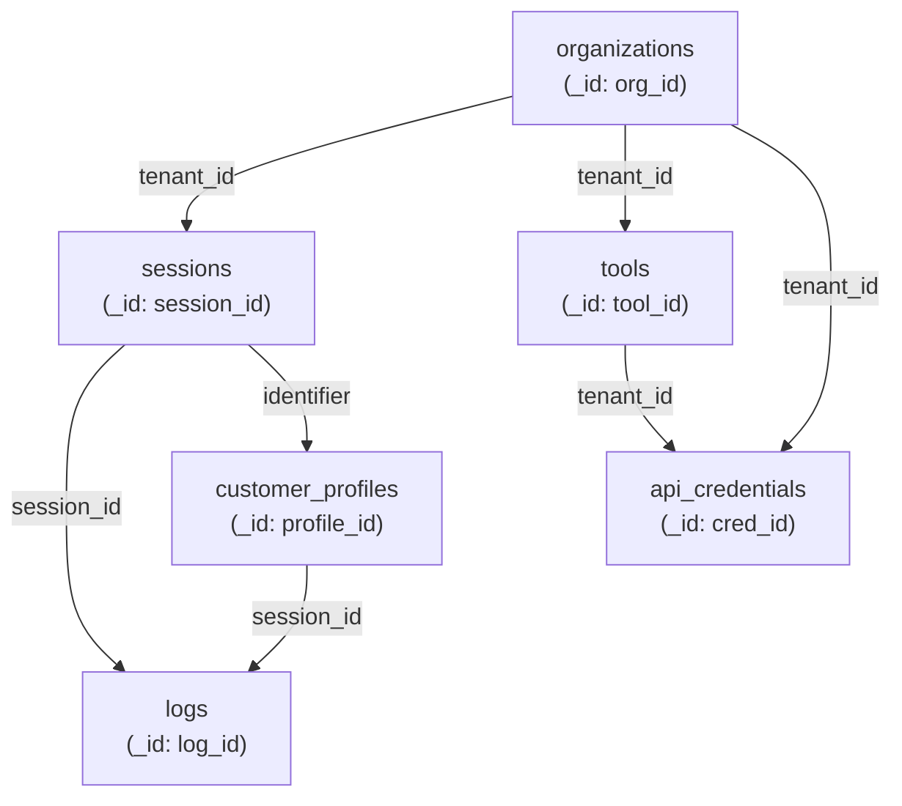

# Database Collections Structure

> 🗄️ **MongoDB schemas** • Data models and collection reference

This document provides a comprehensive reference for the MongoDB collections used by the Pipecat-Service platform.

## Overview

The system uses MongoDB for flexible, document-oriented data storage. All collections use tenant isolation and include audit trails for compliance.

```mermaid
graph TB
    subgraph Core["Core Collections"]
        Sessions["sessions<br/>(call metadata)"]
        Logs["logs<br/>(call details)"]
    end
    
    subgraph Profiles["User Data"]
        Profiles["customer_profiles<br/>(unified identity)"]
    end
    
    subgraph Config["Configuration"]
        Tools["tools<br/>(business tools)"]
        Credentials["api_credentials<br/>(secure auth)"]
        Orgs["organizations<br/>(tenants)"]
    end
    
    Sessions -->|session_id| Logs
    Sessions -->|identifier| Profiles
    Tools -->|tenant_id| Orgs
    Credentials -->|tenant_id| Tools
    Profiles -->|session_id| Logs
```

## Collections Reference

### 1. sessions

**Purpose**: Core session lifecycle and state tracking

**Location**: `db.sessions`

**Schema**:

```json
{
    "_id": "sess-unique-id",
    "agent_type": "voice_assistant",
    "assistant_id": "asst-123",
    "assistant_overrides": {},
    "transport": "webrtc",
    "participants": [
        {
            "type": "user",
            "phone_number": "+1234567890",
            "name": "John Doe"
        },
        {
            "type": "agent",
            "name": "Support Bot"
        }
    ],
    "provider_session_id": "twilio-call-123",
    "created_at": "2024-12-11T10:30:00Z",
    "updated_at": "2024-12-11T10:35:00Z",
    "end_time": "2024-12-11T10:35:00Z",
    "state": "completed",
    "metadata": {
        "language": "en",
        "region": "US"
    },
    "context_summary": {
        "transport_mode": "webrtc",
        "user_details_available": true,
        "custom_context": "vip_customer"
    },
    "created_by": {
        "user_id": "user-123",
        "username": "admin",
        "email": "admin@example.com"
    },
    "updated_by": {
        "user_id": "user-123",
        "username": "admin",
        "email": "admin@example.com"
    }
}
```

**Fields**:

| Field | Type | Description |
|-------|------|-------------|
| `_id` | string | Unique session identifier |
| `agent_type` | string | Type of agent (voice_assistant, etc.) |
| `assistant_id` | string | Reference to assistant config |
| `assistant_overrides` | object | Runtime config overrides |
| `transport` | string | Transport channel (webrtc, twilio, plivo) |
| `participants` | array | List of session participants |
| `provider_session_id` | string | Provider-specific session ID |
| `state` | enum | Session state (preflight, in_flight, completed, error, missed_call, busy, failed) |
| `created_at` | datetime | Session creation timestamp |
| `updated_at` | datetime | Last update timestamp |
| `end_time` | datetime | Session end timestamp |
| `metadata` | object | Additional custom metadata |
| `context_summary` | object | Quick summary of context (for querying) |
| `created_by` | object | User who created session |
| `updated_by` | object | User who last updated session |

**Indexes**:
```javascript
db.sessions.createIndex({ "created_at": -1 })
db.sessions.createIndex({ "state": 1 })
db.sessions.createIndex({ "transport": 1 })
db.sessions.createIndex({ "assistant_id": 1 })
db.sessions.createIndex({ "provider_session_id": 1 })
```

**Query Examples**:
```javascript
// Find completed sessions
db.sessions.find({ "state": "completed" })

// Find sessions by transport
db.sessions.find({ "transport": "twilio" })

// Find sessions for a specific assistant
db.sessions.find({ "assistant_id": "asst-123" })

// Find recent sessions
db.sessions.find({ "created_at": { $gte: ISODate("2024-12-11") } })
```

---

### 2. logs

**Purpose**: Detailed session logs and artifacts

**Location**: `db.logs`

**Schema**:

```json
{
    "_id": "log-unique-id",
    "session_id": "sess-123",
    "transport": "webrtc",
    "assistant_id": "asst-123",
    "assistant_name": "Customer Support",
    "agent_type": "voice_assistant",
    "log_type": "session_artifacts",
    "session_state": "completed",
    "duration_seconds": 305.5,
    "participants": [
        {
            "type": "user",
            "phone_number": "+1234567890",
            "name": "John Doe"
        }
    ],
    "content": [
        {
            "artifact_type": "transcript",
            "content": {
                "messages": [
                    {
                        "role": "user",
                        "content": "Hello, I need help with my account",
                        "timestamp": "2024-12-11T10:30:05Z"
                    },
                    {
                        "role": "assistant",
                        "content": "Hi! I'd be happy to help. What's the issue?",
                        "timestamp": "2024-12-11T10:30:08Z"
                    }
                ]
            }
        },
        {
            "artifact_type": "summary",
            "content": {
                "summary": "Customer called about billing issue",
                "outcome": "Interested",
                "reasoning": "Issue was resolved"
            }
        },
        {
            "artifact_type": "metrics",
            "content": {
                "ttfb_ms": 450,
                "avg_latency_ms": 250,
                "word_count": 348
            }
        },
        {
            "artifact_type": "tool_usage",
            "content": {
                "tool_name": "check_balance",
                "parameters": { "account_id": "123" },
                "result": { "balance": "$50.00" }
            }
        }
    ],
    "created_at": "2024-12-11T10:30:00Z",
    "updated_at": "2024-12-11T10:35:00Z"
}
```

**Fields**:

| Field | Type | Description |
|-------|------|-------------|
| `_id` | string | Unique log identifier |
| `session_id` | string | Reference to session |
| `transport` | string | Transport used |
| `assistant_id` | string | Assistant configuration used |
| `assistant_name` | string | Human-readable assistant name |
| `agent_type` | string | Type of agent |
| `log_type` | enum | Type of log (session_artifacts, system_event) |
| `session_state` | enum | Final state of session |
| `duration_seconds` | float | Total session duration |
| `participants` | array | Session participants |
| `content` | array | Array of artifacts |
| `created_at` | datetime | Creation timestamp |
| `updated_at` | datetime | Update timestamp |

**Artifact Types**:

| Type | Contents | Purpose |
|------|----------|---------|
| `session_log` | Full session log | Complete session record |
| `transcript` | Messages array | Conversation transcript |
| `summary` | Summary object | AI-generated summary |
| `metrics` | Performance data | Latency, throughput metrics |
| `tool_usage` | Tool execution data | Tool calls and results |
| `audio` | S3 path | Audio file location |
| `transport_details` | Transport data | Transport-specific info |
| `agent_configuration` | Config object | Agent config used |
| `error_details` | Error info | Error messages/stacks |
| `participant_data` | Participant info | Participant details |
| `estimated_cost` | Cost breakdown | Token/API cost estimate |
| `metrics_csv` | CSV data | Exported metrics |
| `turn_analytics` | Turn data | Per-turn analysis |

**Indexes**:
```javascript
db.logs.createIndex({ "session_id": 1 })
db.logs.createIndex({ "created_at": -1 })
db.logs.createIndex({ "assistant_id": 1 })
db.logs.createIndex({ "transport": 1 })
```

---

### 3. customer_profiles

**Purpose**: Unified customer identity and history across channels

**Location**: `db.customer_profiles`

**Schema**:

```json
{
    "_id": "prof-unique-id",
    "primary_identifier": "john@example.com",
    "identifier_type": "email",
    "name": "John Doe",
    "email": "john@example.com",
    "phone": "+1234567890",
    "language_preference": "en",
    "preferences": {
        "communication_channel": "email",
        "marketing_emails": false
    },
    "ai_extracted_data": {
        "interests": ["payment_processing", "fraud_detection"],
        "company": "Tech Innovations Inc",
        "communication_preferences": "email preferred",
        "follow_up_date": "2024-12-18",
        "budget_range": "$50k-$100k"
    },
    "linked_identities": [
        {
            "identity_type": "phone",
            "value": "+19876543210",
            "linked_at": "2024-12-01T08:00:00Z"
        }
    ],
    "recent_call_summaries": [
        {
            "session_id": "sess-123",
            "summary_text": "Customer interested in enterprise plan",
            "outcome": "Interested",
            "timestamp": "2024-12-11T10:30:00Z",
            "transport_type": "webrtc",
            "duration_seconds": 305
        }
    ],
    "aggregated_older_summary": "Customer has had 3 previous calls. Started with free tier, upgraded to pro after demo.",
    "total_call_count": 4,
    "created_at": "2024-11-15T12:00:00Z",
    "updated_at": "2024-12-11T10:35:00Z",
    "last_interaction_at": "2024-12-11T10:35:00Z"
}
```

**Fields**:

| Field | Type | Description |
|-------|------|-------------|
| `_id` | string | Unique profile identifier |
| `primary_identifier` | string | Canonical identifier (email or phone) |
| `identifier_type` | enum | Type of primary (email or phone) |
| `name` | string | Customer's name |
| `email` | string | Email address |
| `phone` | string | Phone number (E.164 format) |
| `language_preference` | string | Preferred language (ISO 639-1) |
| `preferences` | object | User-set custom preferences |
| `ai_extracted_data` | object | AI-extracted customer insights |
| `linked_identities` | array | Additional linked identities |
| `recent_call_summaries` | array | Last 4 call summaries |
| `aggregated_older_summary` | string | Summary of calls beyond recent 4 |
| `total_call_count` | integer | Total number of calls |
| `created_at` | datetime | Profile creation timestamp |
| `updated_at` | datetime | Last update timestamp |
| `last_interaction_at` | datetime | Most recent call timestamp |

**CallSummary Schema**:

```json
{
    "session_id": "sess-123",
    "summary_text": "Customer discussed features",
    "outcome": "Interested",
    "timestamp": "2024-12-11T10:30:00Z",
    "transport_type": "webrtc",
    "duration_seconds": 305
}
```

**Indexes**:
```javascript
db.customer_profiles.createIndex({ "primary_identifier": 1 })
db.customer_profiles.createIndex({ "email": 1 })
db.customer_profiles.createIndex({ "phone": 1 })
db.customer_profiles.createIndex({ "linked_identities.value": 1 })
db.customer_profiles.createIndex({ "last_interaction_at": -1 })
```

**Query Examples**:
```javascript
// Find by email
db.customer_profiles.findOne({ "email": "john@example.com" })

// Find by phone
db.customer_profiles.findOne({ "phone": "+1234567890" })

// Find by linked identity
db.customer_profiles.findOne({ "linked_identities.value": "john@company.com" })

// Find recently active customers
db.customer_profiles.find({ 
    "last_interaction_at": { $gte: ISODate("2024-12-01") }
}).sort({ "last_interaction_at": -1 })

// Find customers with AI extraction data
db.customer_profiles.find({ 
    "ai_extracted_data.interests": { $exists: true }
})
```

---

### 4. tools

**Purpose**: Business tool configuration and API integration

**Location**: `db.tools`

**Schema**:

```json
{
    "_id": "tool-unique-id",
    "tenant_id": "tenant-123",
    "name": "send_email",
    "description": "Send an email to a customer",
    "parameters": [
        {
            "name": "recipient_email",
            "type": "email",
            "description": "Email recipient",
            "required": true,
            "examples": ["john@example.com"]
        },
        {
            "name": "subject",
            "type": "string",
            "description": "Email subject",
            "required": true
        }
    ],
    "pre_requests": [
        {
            "name": "verify_contact",
            "description": "Verify email exists",
            "endpoint": "/verify",
            "method": "POST",
            "extract_fields": {
                "verified": "$.verified"
            }
        }
    ],
    "api_config": {
        "base_url": "https://mail-api.example.com",
        "endpoint": "/send",
        "method": "POST",
        "timeout_seconds": 30.0,
        "authentication": {
            "type": "bearer",
            "token": "encrypted:..."
        },
        "query_params": {},
        "body_template": {
            "to": "{{recipient_email}}",
            "subject": "{{subject}}"
        }
    },
    "engaging_words": "Sending your email now...",
    "created_at": "2024-11-01T08:00:00Z",
    "updated_at": "2024-12-01T10:00:00Z",
    "created_by": {
        "user_id": "user-123",
        "username": "admin",
        "email": "admin@example.com"
    },
    "updated_by": {
        "user_id": "user-456",
        "username": "developer",
        "email": "dev@example.com"
    }
}
```

**Fields**:

| Field | Type | Description |
|-------|------|-------------|
| `_id` | string | Unique tool identifier |
| `tenant_id` | string | Tenant scope |
| `name` | string | Tool name (function name for LLM) |
| `description` | string | What the tool does |
| `parameters` | array | Parameters for AI to collect |
| `pre_requests` | array | Pre-request API calls |
| `api_config` | object | Main API configuration |
| `engaging_words` | string | User feedback while running |
| `created_at` | datetime | Creation timestamp |
| `updated_at` | datetime | Update timestamp |
| `created_by` | object | Creator info |
| `updated_by` | object | Last updater info |

**Indexes**:
```javascript
db.tools.createIndex({ "tenant_id": 1, "name": 1 })
db.tools.createIndex({ "created_at": -1 })
db.tools.createIndex({ "tenant_id": 1 })
```

**Query Examples**:
```javascript
// Find tools for a tenant
db.tools.find({ "tenant_id": "tenant-123" })

// Find a specific tool
db.tools.findOne({ "tenant_id": "tenant-123", "name": "send_email" })

// Find all tools created after date
db.tools.find({ "created_at": { $gte: ISODate("2024-12-01") } })
```

---

### 5. api_credentials

**Purpose**: Encrypted API credentials for CustomTokenDB authentication

**Location**: `db.api_credentials`

**Schema**:

```json
{
    "_id": "cred-unique-id",
    "tenant_id": "tenant-123",
    "name": "Production CRM API",
    "description": "CRM system API credentials with token rotation",
    "api_endpoint": "https://crm-api.example.com",
    "credential_type": "custom_token_db",
    "auth_flow": "client_credentials",
    "client_id": "encrypted:...",
    "client_secret": "encrypted:...",
    "token_endpoint": "https://auth.example.com/oauth/token",
    "token_extraction_path": {
        "access_token": "$.access_token",
        "id_token": "$.id_token"
    },
    "token_headers": {
        "X-Access-Token": "{{access_token}}",
        "X-ID-Token": "{{id_token}}"
    },
    "current_tokens": {
        "access_token": "encrypted:...",
        "id_token": "encrypted:...",
        "expires_at": "2024-12-12T15:30:00Z"
    },
    "refresh_threshold_minutes": 5,
    "is_active": true,
    "created_at": "2024-11-15T08:00:00Z",
    "updated_at": "2024-12-11T10:00:00Z",
    "last_token_refresh": "2024-12-11T09:55:00Z"
}
```

**Fields**:

| Field | Type | Description |
|-------|------|-------------|
| `_id` | string | Unique credential identifier |
| `tenant_id` | string | Tenant scope |
| `name` | string | Human-readable name |
| `description` | string | Credential purpose |
| `api_endpoint` | string | API being accessed |
| `credential_type` | string | Type (custom_token_db) |
| `client_id` | string | OAuth client ID (encrypted) |
| `client_secret` | string | OAuth secret (encrypted) |
| `token_endpoint` | string | Token refresh endpoint |
| `token_extraction_path` | object | JSONPath for token extraction |
| `token_headers` | object | Headers to use with tokens |
| `current_tokens` | object | Currently cached tokens (encrypted) |
| `refresh_threshold_minutes` | integer | Refresh before expiry |
| `is_active` | boolean | Whether credential is active |
| `created_at` | datetime | Creation timestamp |
| `updated_at` | datetime | Update timestamp |
| `last_token_refresh` | datetime | Last refresh timestamp |

**Indexes**:
```javascript
db.api_credentials.createIndex({ "tenant_id": 1, "name": 1 })
db.api_credentials.createIndex({ "is_active": 1 })
db.api_credentials.createIndex({ "last_token_refresh": -1 })
```

---

### 6. organizations

**Purpose**: Tenant/organization management

**Location**: `db.organizations`

**Schema**:

```json
{
    "_id": "org-unique-id",
    "name": "Acme Corporation",
    "slug": "acme-corp",
    "description": "Enterprise customer",
    "tier": "enterprise",
    "status": "active",
    "settings": {
        "max_concurrent_sessions": 100,
        "retention_days": 90,
        "enable_analytics": true
    },
    "billing": {
        "plan": "enterprise",
        "monthly_rate": 5000,
        "next_billing_date": "2025-01-11",
        "payment_method": "credit_card"
    },
    "members": [
        {
            "user_id": "user-123",
            "email": "admin@acme.com",
            "role": "admin",
            "joined_at": "2024-01-15T08:00:00Z"
        }
    ],
    "created_at": "2024-01-15T08:00:00Z",
    "updated_at": "2024-12-11T10:00:00Z"
}
```

**Fields**:

| Field | Type | Description |
|-------|------|-------------|
| `_id` | string | Organization ID (also tenant_id) |
| `name` | string | Organization name |
| `slug` | string | URL-friendly identifier |
| `description` | string | Organization description |
| `tier` | enum | Pricing tier (free, pro, enterprise) |
| `status` | enum | Organization status |
| `settings` | object | Org-specific settings |
| `billing` | object | Billing information |
| `members` | array | Team members |
| `created_at` | datetime | Creation timestamp |
| `updated_at` | datetime | Update timestamp |

**Indexes**:
```javascript
db.organizations.createIndex({ "slug": 1 })
db.organizations.createIndex({ "status": 1 })
```

---

## Data Relationships



## Tenant Isolation

All collections include `tenant_id` or scoping to ensure multi-tenancy:

```javascript
// Every query implicitly includes tenant_id
db.tools.find({ 
    "tenant_id": "tenant-123",
    "name": "send_email"
})
```

## Lifecycle Patterns

### Session Lifecycle

```
CREATE (sessions) 
  ↓ (participant joins)
IN_FLIGHT (messages accumulate)
  ↓ (end call)
INSERT (logs with artifacts)
  ↓ (summarization)
UPDATE (customer_profiles with summary)
```

### Profile Lifecycle

```
CREATE (customer_profiles) when first contact
  ↓ (link identities)
UPDATE (linked_identities)
  ↓ (call happens)
UPDATE (recent_call_summaries, ai_extracted_data)
  ↓ (5 calls)
UPDATE (aggregated_older_summary)
```

## Retention & Archival

- **Sessions**: Keep indefinitely
- **Logs**: Retain 90-365 days (configurable)
- **Profiles**: Retain indefinitely (with archival)
- **Credentials**: Retain while active
- **Audit Trail**: Retain for compliance (7 years)

## Performance Optimization

### Query Patterns

```javascript
// Fast: Use indexed fields
db.customer_profiles.findOne({ "email": "..." })

// Fast: Tenant-scoped query
db.tools.find({ "tenant_id": "...", "name": "..." })

// Slow: Full collection scan
db.customer_profiles.find({ "preferences.key": "value" })
```

### Aggregation Pipeline Example

```javascript
// Get metrics by assistant
db.sessions.aggregate([
    { $match: { "created_at": { $gte: ISODate("2024-12-01") } } },
    { $group: { 
        _id: "$assistant_id",
        count: { $sum: 1 },
        avg_duration: { $avg: "$duration_seconds" }
    }},
    { $sort: { count: -1 } }
])
```

## See Also

- [ARCHITECTURE_OVERVIEW.md](ARCHITECTURE_OVERVIEW.md) - Data flow and architecture
- [CONFIGURABLE_SUMMARIES.md](CONFIGURABLE_SUMMARIES.md) - Profile update and AI extraction
- [BUSINESS_TOOLS_GUIDE.md](BUSINESS_TOOLS_GUIDE.md) - Tools collection details
- [API_GUIDE.md](API_GUIDE.md) - API endpoints using these collections
- [README.md](README.md) - Documentation index

---

📖 **Return to**: [README.md](README.md)
