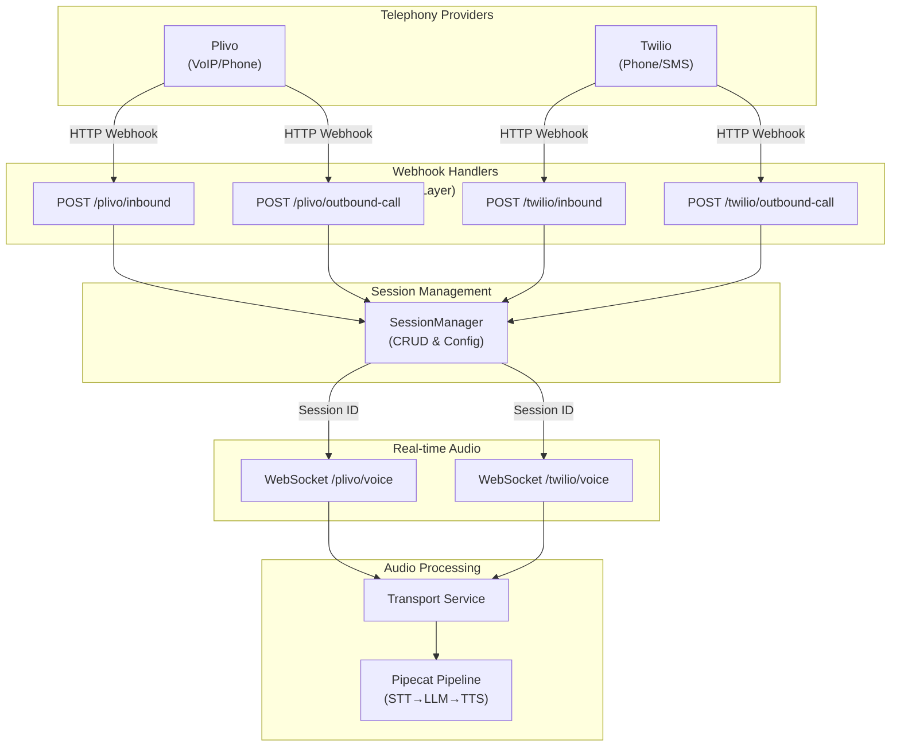
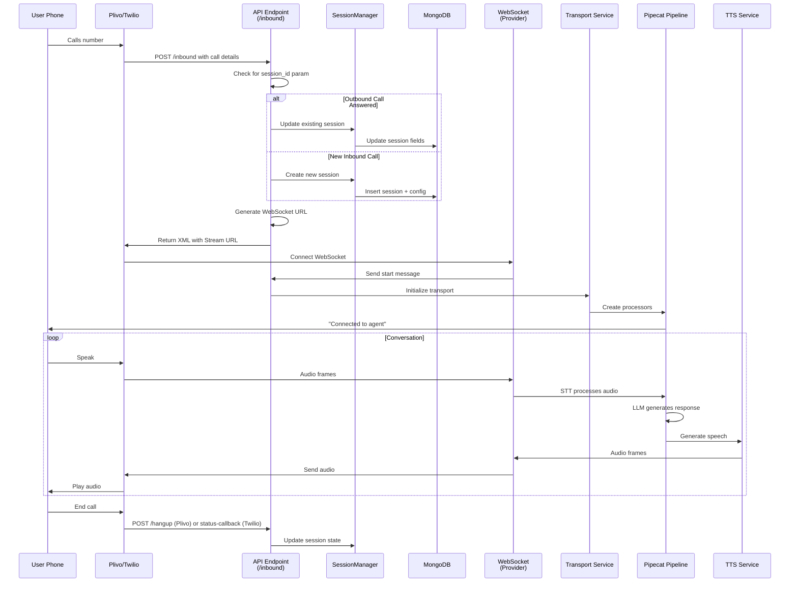
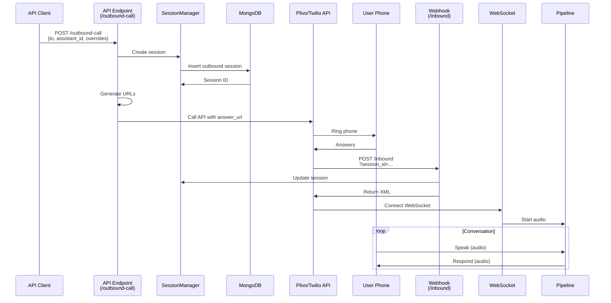
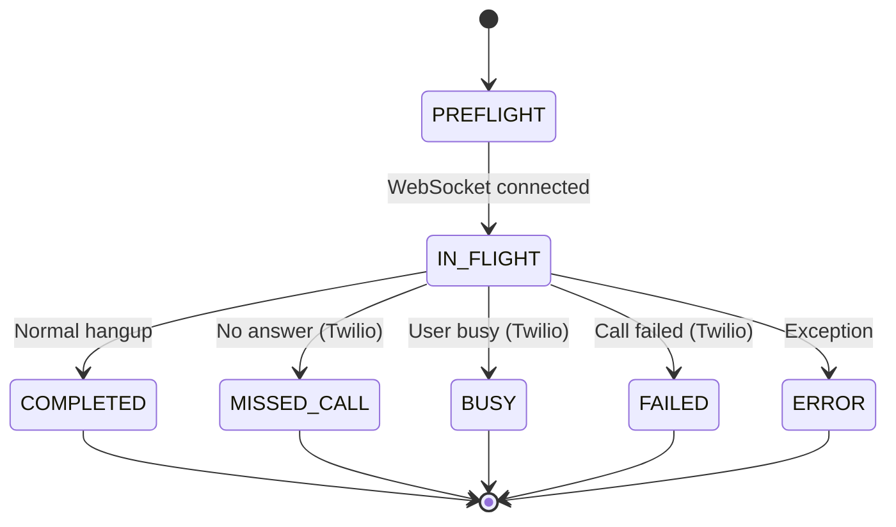

# Telephony Flows & Entry Points

> 📞 **Telephony Integration** • Plivo and Twilio call flows, entry points, and WebSocket protocols

## Overview

The Pipecat-Service supports two major telephony providers for voice agent integration:

- **Plivo**: Cloud communications platform with programmable voice
- **Twilio**: Leading communications platform as a service

Both providers are integrated through a webhook-based architecture where:
1. Incoming calls trigger webhooks to your application
2. Your application returns XML/JSON with streaming URLs
3. The provider connects a WebSocket for real-time audio
4. Audio frames flow through the Pipecat pipeline
5. Responses are sent back through the pipeline to the provider

### Key Architecture Patterns



---

## Entry Points

### Plivo Entry Points

| Endpoint | Method | Purpose | Auth |
|----------|--------|---------|------|
| `/plivo/inbound` | POST | Receive inbound call webhook | None (from provider) |
| `/plivo/outbound-call` | POST | Initiate outbound call | Bearer token |
| `/plivo/outbound-call-noauth` | POST | Outbound call (testing) | None |
| `/plivo/voice/{call_id}` | WebSocket | Real-time audio stream | Query params |
| `/plivo/hangup` | POST | Call termination webhook | None (from provider) |
| `/plivo/conference-join` | POST | Warm transfer conference | None (from provider) |

### Twilio Entry Points

| Endpoint | Method | Purpose | Auth |
|----------|--------|---------|------|
| `/twilio/inbound` | POST | Receive inbound call webhook | None (from provider) |
| `/twilio/outbound-call` | POST | Initiate outbound call | Bearer token |
| `/twilio/voice/{call_sid}` | WebSocket | Real-time audio stream | Query params |
| `/twilio/status-callback` | POST | Call status updates | None (from provider) |

---

## Inbound Call Flow

### Flow Diagram



### Step-by-Step Flow

#### Plivo Inbound

1. **User initiates call**
   - User dials your Plivo number
   
2. **Webhook received**
   - Plivo sends POST to `/plivo/inbound` with:
     - `CallUUID`: Unique call identifier
     - `From`: Caller phone number
     - `To`: Destination number (your Plivo number)
     - Other call metadata

3. **Session decision**
   - Check for `session_id` query parameter:
     - **Present**: Existing outbound call being answered → Update session
     - **Absent**: New inbound call → Create new session

4. **Generate WebSocket URL**
   ```
   wss://host/vagent/api/plivo/voice/{call_uuid}?session_id={id}&tenant_id={id}
   ```

5. **Return XML**
   - Application returns XML with `<Stream>` element
   - Plivo connects WebSocket to URL

6. **WebSocket connection**
   - `/plivo/voice/{call_id}` endpoint accepts WebSocket
   - Extract `session_id` and `tenant_id` from query params
   - Load agent configuration from session
   - Initialize BaseAgent

7. **Receive start message**
   ```json
   {
       "start": {
           "streamId": "stream-uuid",
           "callUUID": "call-uuid",
           "timestamp": "2024-12-11T10:30:00.000Z"
       }
   }
   ```

8. **Start pipeline**
   - Create PlivoFrameSerializer
   - Create transport with serializer
   - Start Pipecat pipeline
   - Audio frames flow in real-time

9. **Conversation**
   - Audio → STT → Text
   - Text → LLM → Response
   - Response → TTS → Audio

10. **Call termination**
    - User hangs up or call ends
    - Plivo sends POST to `/plivo/hangup`
    - Session state updated to COMPLETED

#### Twilio Inbound

1. **User initiates call**
   - User dials your Twilio number

2. **Webhook received**
   - Twilio sends POST to `/twilio/inbound` with form data:
     - `CallSid`: Unique call identifier
     - `From`: Caller phone number
     - `To`: Destination number (your Twilio number)
     - Other call metadata

3. **Session decision**
   - Check for `session_id` query parameter:
     - **Present**: Existing outbound call being answered → Update session
     - **Absent**: New inbound call → Create new session

4. **Generate Stream URL**
   ```
   wss://host/vagent/api/twilio/voice/{call_sid}
   ```

5. **Return TwiML XML**
   - Application returns TwiML with `<Stream>` element
   - Include custom parameters in Stream URL

6. **WebSocket connection**
   - `/twilio/voice/{call_sid}` endpoint accepts WebSocket
   - First message: MediaFormat
   - Second message: Start with customParameters

7. **Receive start message**
   ```json
   {
       "event": "start",
       "sequenceNumber": "1",
       "start": {
           "streamSid": "stream-sid",
           "callSid": "call-sid",
           "customParameters": {
               "session_id": "session-id",
               "tenant_id": "tenant-id"
           }
       }
   }
   ```

8. **Start pipeline**
   - Create TwilioFrameSerializer
   - Create transport with serializer
   - Start Pipecat pipeline
   - Audio frames flow in real-time

9. **Conversation**
   - Same as Plivo (STT → LLM → TTS)

10. **Call termination**
    - User hangs up or call ends
    - Twilio sends POST to `/twilio/status-callback`
    - Map Twilio CallStatus to SessionState
    - Session state updated accordingly

---

## Outbound Call Flow

### Flow Diagram



### Step-by-Step Flow

#### Plivo Outbound

1. **Initiate outbound call**
   ```bash
   POST /plivo/outbound-call
   {
       "to": "+1234567890",
       "assistant_id": "asst-123",
       "assistant_overrides": {...}
   }
   ```

2. **Create session**
   - Generate session_id (UUID)
   - Create session with:
     - `transport: "plivo"`
     - `participants`: System + User
     - `metadata.call_direction: "outbound"`

3. **Prepare Plivo call**
   - Generate answer_url: `https://host/plivo/inbound?session_id={id}&tenant_id={id}`
   - Generate hangup_url: `https://host/plivo/hangup?session_id={id}&tenant_id={id}`

4. **Initiate Plivo call**
   ```python
   response = client.calls.create(
       from_=from_number,
       to_=to_number,
       answer_url=answer_url,
       answer_method="POST",
       hangup_url=hangup_url,
       hangup_method="POST"
   )
   ```

5. **Return to client**
   ```json
   {
       "message": "Call initiated",
       "call_id": "request-uuid",
       "session_id": "session-id"
   }
   ```

6. **User answers call**
   - Phone rings at destination
   - User picks up

7. **Answer webhook**
   - Plivo calls answer_url with `session_id` as param
   - Flow continues as inbound (Step 2-8 of Inbound Flow)

#### Twilio Outbound

1. **Initiate outbound call**
   ```bash
   POST /twilio/outbound-call
   {
       "to": "+1234567890",
       "assistant_id": "asst-123",
       "assistant_overrides": {...}
   }
   ```

2. **Create session**
   - Generate session_id (UUID)
   - Create session with:
     - `transport: "twilio"`
     - `participants`: System + User
     - `metadata.call_direction: "outbound"`

3. **Prepare Twilio call**
   - Generate answer_url: `https://host/twilio/inbound?session_id={id}&tenant_id={id}`
   - Generate status_callback_url: `https://host/twilio/status-callback?session_id={id}&tenant_id={id}`

4. **Initiate Twilio call**
   ```python
   call = client.calls.create(
       from_=from_number,
       to=to_number,
       url=answer_url,
       method="POST",
       status_callback=status_callback_url,
       status_callback_method="POST",
       status_callback_event=["completed"]
   )
   ```

5. **Return to client**
   ```json
   {
       "message": "Call initiated",
       "call_id": "call-sid",
       "session_id": "session-id"
   }
   ```

6. **User answers call**
   - Phone rings at destination
   - User picks up

7. **Answer webhook**
   - Twilio calls answer_url with session_id as param
   - Flow continues as inbound (Step 2-8 of Inbound Flow)

---

## WebSocket Protocol Details

### Plivo WebSocket

**URL Format**:
```
wss://host/vagent/api/plivo/voice/{call_id}?session_id={id}&tenant_id={id}
```

**Connection Parameters**:
- `call_id`: Plivo call UUID from inbound webhook
- `session_id`: Session identifier for config lookup
- `tenant_id`: Tenant database name for multi-tenancy

**Start Message** (from Plivo):
```json
{
    "start": {
        "streamId": "stream-uuid-from-plivo",
        "callUUID": "call-uuid",
        "timestamp": "2024-12-11T10:30:00Z"
    }
}
```

**Audio Frames** (continuous, both directions):
- Format: Binary Plivo frame format
- Sample Rate: 8kHz (telephony standard)
- Encoding: PCM
- Frame Serializer: `PlivoFrameSerializer`

**Processing Pipeline**:
```
Transport (receives WebSocket frames)
  ↓
PlivoFrameSerializer (deserializes)
  ↓
AudioFrame (STT processor input)
  ↓
STT Service (converts audio to text)
  ↓
LLM Service (generates response)
  ↓
TTS Service (converts text to audio)
  ↓
AudioFrame (serializer output)
  ↓
PlivoFrameSerializer (serializes)
  ↓
Transport (sends WebSocket frames)
```

### Twilio WebSocket

**URL Format**:
```
wss://host/vagent/api/twilio/voice/{call_sid}
```

**Start Messages** (from Twilio):

1. **MediaFormat** (first message):
```json
{
    "event": "start",
    "sequenceNumber": "0",
    "start": {
        "streamSid": "stream-sid",
        "accountSid": "account-sid",
        "callSid": "call-sid",
        "mediaFormat": {
            "encoding": "audio/x-mulaw",
            "sampleRate": 8000,
            "channels": 1
        },
        "customParameters": {}
    }
}
```

2. **Start** (second message):
```json
{
    "event": "start",
    "sequenceNumber": "1",
    "start": {
        "streamSid": "stream-sid",
        "callSid": "call-sid",
        "accountSid": "account-sid",
        "customParameters": {
            "session_id": "session-id",
            "tenant_id": "tenant-id"
        }
    }
}
```

**Audio Frames** (continuous, both directions):
- Format: Binary Twilio frame format
- Sample Rate: 8kHz (telephony standard)
- Encoding: µ-law (mu-law)
- Frame Serializer: `TwilioFrameSerializer`

**Processing Pipeline**:
Same as Plivo but uses `TwilioFrameSerializer`

---

## Session Management

### Session Creation

```python
# Inbound - new call
session = await session_manager.create_session(
    session_id=session_id,
    assistant_id=assistant_id,
    participants=[
        ParticipantDetails(role=ParticipantRole.SYSTEM, phone_number=to_number),
        ParticipantDetails(role=ParticipantRole.USER, phone_number=from_number)
    ],
    transport="plivo",  # or "twilio"
    provider_session_id=call_uuid,  # or call_sid
    metadata={"inbound_http_request": form_data}
)

# Outbound - initiating call
session = await session_manager.create_session(
    session_id=session_id,
    assistant_id=assistant_id,
    participants=[
        ParticipantDetails(role=ParticipantRole.SYSTEM, phone_number=from_number),
        ParticipantDetails(role=ParticipantRole.USER, phone_number=to_number, name=user_name)
    ],
    transport="plivo",  # or "twilio"
    metadata={"call_direction": "outbound"}
)
```

### Session State Transitions

```
Initial: PREFLIGHT
  ↓
IN_FLIGHT (call answered, WebSocket connected)
  ↓
COMPLETED (successful call)
  ├─ MISSED_CALL (Twilio: no-answer)
  ├─ BUSY (Twilio: busy)
  └─ FAILED (Twilio: failed)
```

### Provider Session ID Mapping

```python
# Session stores mapping between our ID and provider ID
session.provider_session_id = call_uuid  # Plivo
session.provider_session_id = call_sid   # Twilio

# Also stored in metadata for reference
session.metadata["call_metadata"] = {
    "provider": "plivo",  # or "twilio"
    "provider_session_id": call_uuid,
    "call_direction": "inbound",  # or "outbound"
    "timestamp": datetime.now(UTC).isoformat()
}
```

---

## Call Lifecycle

### Lifecycle States



### Lifecycle Events

**On Call Answered**:
- Session state: PREFLIGHT → IN_FLIGHT
- WebSocket connected
- Pipeline initialized
- Agent listening

**During Conversation**:
- Audio frames flowing
- STT processing
- LLM generating responses
- TTS producing audio

**On Call End**:
- Hangup webhook received
- Pipeline stopped
- Session state updated
- Logs persisted

---

## Error Handling

### Common Error Scenarios

| Scenario | Status | Handling |
|----------|--------|----------|
| **Invalid credentials** | 401 | Return XML with error message |
| **Invalid phone number** | 400 | Return error to client |
| **Provider API error** | 500 | Log error, retry or fail gracefully |
| **WebSocket disconnection** | - | Clean up resources, update session |
| **Session not found** | 404 | Close WebSocket, log error |
| **Invalid tenant** | 403 | Close WebSocket, return error |
| **LLM timeout** | 504 | Use fallback response |
| **Audio frame error** | - | Log and continue |

### Error Response Examples

**Plivo XML Error**:
```xml
<?xml version="1.0" encoding="UTF-8"?>
<Response>
    <Speak>Sorry, there was an error connecting to the agent. Please try again.</Speak>
    <Hangup/>
</Response>
```

**Twilio TwiML Error**:
```xml
<?xml version="1.0" encoding="UTF-8"?>
<Response>
    <Say>Sorry, there was an error connecting to the agent. Please try again.</Say>
    <Hangup/>
</Response>
```

---

## Configuration Requirements

### Environment Variables

```bash
# Plivo Configuration
PLIVO_AUTH_ID=your-plivo-auth-id
PLIVO_AUTH_TOKEN=your-plivo-auth-token
PLIVO_PHONE_NUMBER=+1234567890        # Your Plivo number

# Twilio Configuration
TWILIO_ACCOUNT_SID=your-account-sid
TWILIO_AUTH_TOKEN=your-auth-token
TWILIO_PHONE_NUMBER=+1987654321       # Your Twilio number

# Webhook Configuration
BASE_URL=https://your-domain.com      # Public URL for webhooks
```

### Webhook URL Setup

**Plivo**:
1. Create Plivo Application
2. Set Answer URL: `https://your-domain.com/vagent/api/plivo/inbound`
3. Set Hangup URL: `https://your-domain.com/vagent/api/plivo/hangup`
4. Assign phone number to application

**Twilio**:
1. Configure phone number
2. Set Voice URL: `https://your-domain.com/vagent/api/twilio/inbound`
3. Set Status Callback URL: `https://your-domain.com/vagent/api/twilio/status-callback`

---

## Code Examples

### Example 1: Inbound Call Handler

```python
# From src/app/api/plivo_api.py
@plivo_router.post("/inbound", response_class=HTMLResponse)
async def inbound_call(request: Request, db: AsyncIOMotorDatabase = Depends(get_db_from_request)):
    form = await request.form()
    call_uuid = form.get("CallUUID")
    tenant_id = db.name
    session_manager = SessionManager(db)
    
    # Check for existing session (outbound call answered)
    session_id = request.query_params.get("session_id")
    
    if session_id:
        # Update existing session
        await session_manager.update_session_fields(session_id, {
            "provider_session_id": call_uuid,
            "metadata.inbound_http_request": dict(form)
        })
    else:
        # Create new inbound session
        assistant_id = request.query_params.get("assistant_id", "default")
        participants = [
            ParticipantDetails(role=ParticipantRole.SYSTEM, phone_number=form.get("To")),
            ParticipantDetails(role=ParticipantRole.USER, phone_number=form.get("From"))
        ]
        
        session_id = str(uuid.uuid4())
        await session_manager.create_session(
            session_id=session_id,
            assistant_id=assistant_id,
            participants=participants,
            transport="plivo",
            provider_session_id=call_uuid,
            metadata={"inbound_http_request": dict(form)}
        )
    
    # Generate WebSocket URL
    base_url = request.base_url
    wss_url = f"wss://{base_url.hostname}/vagent/api/plivo/voice/{call_uuid}?session_id={session_id}&tenant_id={tenant_id}"
    
    # Return XML with Stream URL
    async with aiofiles.open("src/app/templates/plivo_streams.xml") as f:
        xml_content = (await f.read()).replace("{{WSS_URL}}", wss_url)
    
    return HTMLResponse(content=xml_content, media_type="application/xml")
```

### Example 2: Outbound Call Initiation

```python
# From src/app/api/plivo_api.py
@plivo_router.post("/outbound-call", response_model=schemas.OutboundCallResponse)
async def outbound_call(request: Request, data: schemas.OutboundCallRequest, 
                        current_user: dict = Depends(get_current_user),
                        db: AsyncIOMotorDatabase = Depends(get_db)):
    client = plivo.RestClient(settings.PLIVO_AUTH_ID, settings.PLIVO_AUTH_TOKEN)
    base_url = request.base_url
    tenant_id = db.name
    session_id = str(uuid.uuid4())
    
    # Create session
    session_manager = SessionManager(db)
    await session_manager.create_session(
        session_id=session_id,
        assistant_id=data.assistant_id or "default",
        participants=[
            ParticipantDetails(role=ParticipantRole.SYSTEM, phone_number=data.from_number),
            ParticipantDetails(role=ParticipantRole.USER, phone_number=data.to)
        ],
        transport="plivo",
        metadata={"call_direction": "outbound"}
    )
    
    # Prepare URLs
    answer_url = f"https://{base_url.hostname}/vagent/api/plivo/inbound?session_id={session_id}&tenant_id={tenant_id}"
    hangup_url = f"https://{base_url.hostname}/vagent/api/plivo/hangup?session_id={session_id}&tenant_id={tenant_id}"
    
    # Initiate call
    response = client.calls.create(
        from_=data.from_number,
        to_=data.to,
        answer_url=answer_url,
        answer_method="POST",
        hangup_url=hangup_url,
        hangup_method="POST"
    )
    
    return {"message": "Call initiated", "call_id": response.request_uuid, "session_id": session_id}
```

### Example 3: WebSocket Connection

```python
# From src/app/api/plivo_api.py
@plivo_router.websocket("/voice/{call_id}")
async def voice(websocket: WebSocket, params: PlivoVoiceParams = Depends()):
    await websocket.accept()
    
    try:
        session_id = websocket.query_params.get("session_id")
        tenant_id = websocket.query_params.get("tenant_id")
        
        if not session_id or not tenant_id:
            await websocket.close(code=1008)
            return
        
        # Get database and session
        db = get_database(tenant_id, MongoClient.get_client())
        session_manager = SessionManager(db)
        agent_config = await session_manager.get_and_consume_config(
            session_id=session_id,
            transport_name="plivo",
            provider_session_id=params.call_id
        )
        
        # Initialize agent
        agent = BaseAgent(agent_config=agent_config)
        
        # Run bot (starts pipeline)
        await run_plivo_bot(
            websocket=websocket,
            stream_id=stream_id,
            call_id=params.call_id,
            session_id=session_id,
            tenant_id=tenant_id,
            agent=agent,
            start_message=start_message
        )
    
    except Exception as e:
        logger.error(f"WebSocket error: {e}")
        await websocket.close()
```

### Example 4: Twilio Status Callback

```python
# From src/app/api/twilio_api.py
@twilio_router.post("/status-callback", response_class=HTMLResponse)
async def status_callback(request: Request):
    data = await request.form()
    
    call_sid = data.get("CallSid")
    call_status = data.get("CallStatus")  # "completed", "no-answer", "busy", "failed"
    call_duration = data.get("CallDuration")
    
    session_id = request.query_params.get("session_id")
    tenant_id = request.query_params.get("tenant_id")
    
    if session_id and tenant_id:
        db = get_database(tenant_id, MongoClient.get_client())
        session_manager = SessionManager(db)
        
        # Map Twilio status to session state
        state_map = {
            "completed": SessionState.COMPLETED,
            "no-answer": SessionState.MISSED_CALL,
            "busy": SessionState.BUSY,
            "failed": SessionState.FAILED
        }
        
        new_state = state_map.get(call_status, SessionState.COMPLETED)
        
        # Update session
        await session_manager.update_session_fields(
            session_id,
            {
                "state": new_state,
                "end_time": datetime.now(UTC),
                "metadata.call_metadata": {
                    "provider": "twilio",
                    "call_sid": call_sid,
                    "call_status": call_status,
                    "duration_seconds": int(call_duration) if call_duration else None
                }
            }
        )
    
    return HTMLResponse(content="<Response></Response>", media_type="application/xml")
```

---

## Provider-Specific Differences

| Feature | Plivo | Twilio |
|---------|-------|--------|
| **Webhook Format** | Form-encoded | Form-encoded |
| **Call ID** | CallUUID | CallSid |
| **Stream ID** | streamId | streamSid |
| **Initial Message** | Single start message | MediaFormat + Start |
| **Status Updates** | Hangup callback | Status callback |
| **Audio Format** | PCM | µ-law |
| **Warm Transfer** | Supported (conferences) | Limited (requires SIP) |
| **Cost Model** | Per-minute | Per-minute + API calls |
| **Global Coverage** | 190+ countries | 200+ countries |

---

## Warm Transfer Support

### Plivo Warm Transfer

Plivo supports warm transfers through conference functionality:

1. **Original call** connects to agent
2. **Agent initiates transfer** by calling tool
3. **Conference created** with agent and supervisor
4. **Customer put on hold** with hold music
5. **Supervisor joins** conference
6. **Customer connected** to supervisor
7. **Agent can drop off** leaving customer with supervisor

### Twilio Warm Transfer

Twilio has limited native warm transfer support. Common workaround:

1. **Create new outbound call** to supervisor
2. **Merge calls** (SIP trunking required)
3. **Alternative**: Use bridge/conference through Flex

---

## See Also

- [API_GUIDE.md](API_GUIDE.md) - Complete API endpoint reference
- [ARCHITECTURE_OVERVIEW.md](ARCHITECTURE_OVERVIEW.md) - System design overview
- [DATABASE_COLLECTIONS_STRUCTURE.md](DATABASE_COLLECTIONS_STRUCTURE.md) - Session schema
- [README.md](README.md) - Documentation index

---

📖 **Return to**: [README.md](README.md)

